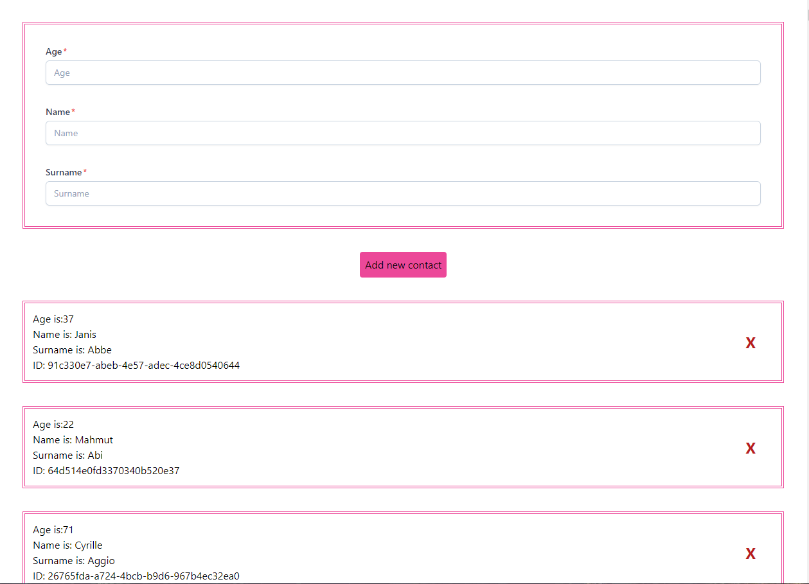

## I used in this project

<h1>Backend</h1>
<ul>
    <li>SANIC</li>
    <li>SANIC-MOTOR</li>
    <li>CORS</li>
    <li>MONGODB</li>
</ul>

---
<h1>Frontend</h1>
<ul>
    <li>React</li>
    <li>Taiwind</li>
    <li>RestAPI</li>
</ul>

---

